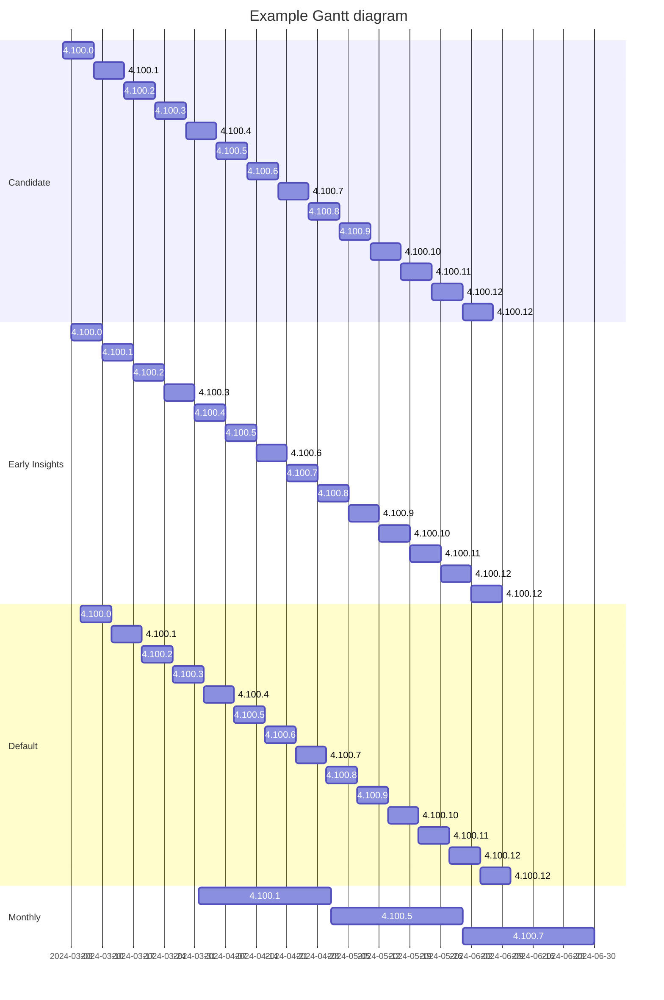

# Policy Gantt Chart

```mermaid
gantt
 title Example Gantt diagram
    dateFormat  YYYY-MM-DD
    section Candidate
    4.100.0 :c41000, 2024-03-01,7d
    4.100.1 :c41001, after c41000, 7d
    4.100.2 :c41002, after c41001, 7d
    4.100.3 :c41003, after c41002, 7d
    4.100.4 :c41004, after c41003, 7d
    4.100.5 :c41005, after c41004, 7d
    4.100.6 :c41006, after c41005, 7d
    4.100.7 :c41007, after c41006, 7d
    4.100.8 :c41008, after c41007, 7d
    4.100.9 :c41009, after c41008, 7d
    4.100.10 :c410010, after c41009, 7d
    4.100.11 :c410011, after c410010, 7d
    4.100.12 :c410012, after c410011, 7d
    4.100.12 :c410013, after c410012, 7d
    section Early Insights
    4.100.0 :ea41000, 2024-03-03,7d
    4.100.1 :ea41001, after ea41000, 7d
    4.100.2 :ea41002, after ea41001, 7d
    4.100.3 :ea41003, after ea41002, 7d
    4.100.4 :ea41004, after ea41003, 7d
    4.100.5 :ea41005, after ea41004, 7d
    4.100.6 :ea41006, after ea41005, 7d
    4.100.7 :ea41007, after ea41006, 7d
    4.100.8 :ea41008, after ea41007, 7d
    4.100.9 :ea41009, after ea41008, 7d
    4.100.10 :ea410010, after ea41009, 7d
    4.100.11 :ea410011, after ea410010, 7d
    4.100.12 :ea410012, after ea410011, 7d
    4.100.12 :ea410013, after ea410012, 7d
    Section Default
    4.100.0 :d41000, 2024-03-05,7d
    4.100.1 :d41001, after d41000, 7d
    4.100.2 :d41002, after d41001, 7d
    4.100.3 :d41003, after d41002, 7d
    4.100.4 :d41004, after d41003, 7d
    4.100.5 :d41005, after d41004, 7d
    4.100.6 :d41006, after d41005, 7d
    4.100.7 :d41007, after d41006, 7d
    4.100.8 :d41008, after d41007, 7d
    4.100.9 :d41009, after d41008, 7d
    4.100.10 :d410010, after d41009, 7d
    4.100.11 :d410011, after d410010, 7d
    4.100.12 :d410012, after d410011, 7d
    4.100.12 :d410013, after d410012, 7d
    Section Monthly
    4.100.1 :m41001, 2024-04-01, 30d
    4.100.5 :m41005, after m41001, 30d
    4.100.7 :m41007, after m41005, 30d
```

