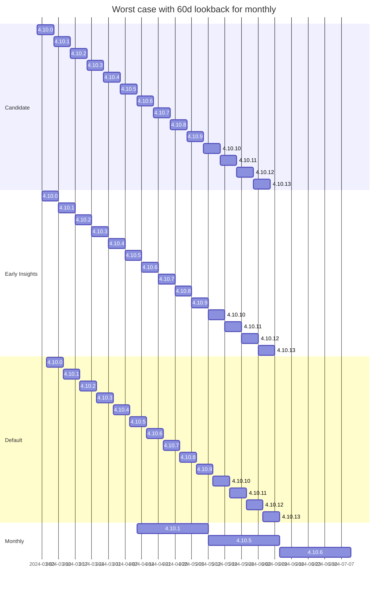
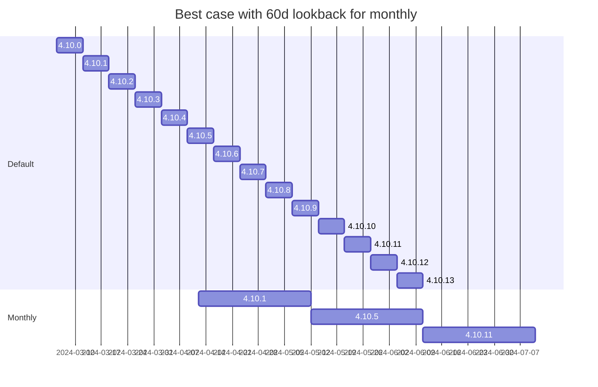

# Policy Gantt Chart
Monthly policy ships each second tuesday and picks a version shipped previously up to 60d old based on non public method used to determine the best version. 

Worst case, the third monthly release has to go back to the oldest but newer z-stream

Best case, we select relatively current monthly versions which are approximately 14 days old at time of delivery
Candidate and Early Insights removed for brevity

