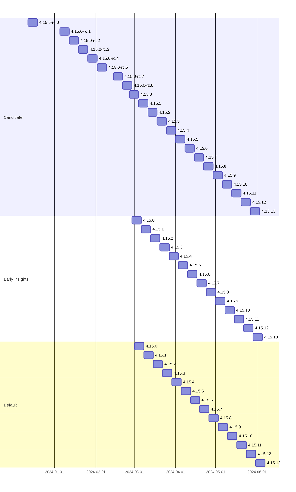
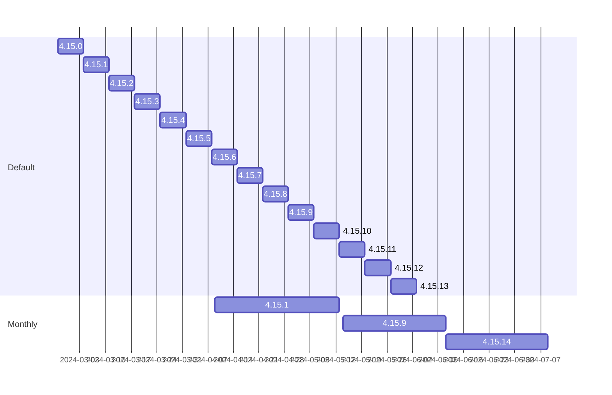

# Hypothetical 4.15 rollout with Policies
Monthly policy ships each second tuesday and picks a version shipped no less than 7d old but no more than 30d ago yielding a 61d maximum latency in the event that the desired fix ships the day after the selected version due to having to wait for next cycle.
48hr delay between Candidate, Early Insights, and Default respectively

First, Candidate, Early Insights, and Default channels only

Lowest latency case, each time we select the newest version that's at least 7d old.

Candidate and Early Insights removed for brevity

Now, oldest possible selection for two subsequent monthly recommendations. The person waiting for the fix in either 4.15.7, or 4.15.12 has to wait 60 days from the time that version is available in default channel.

Candidate and Early Insights removed for brevity

