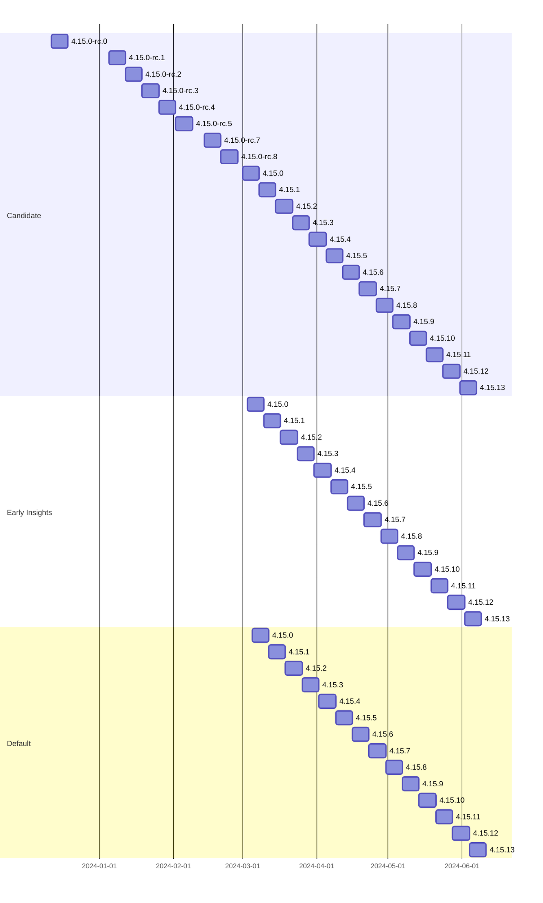
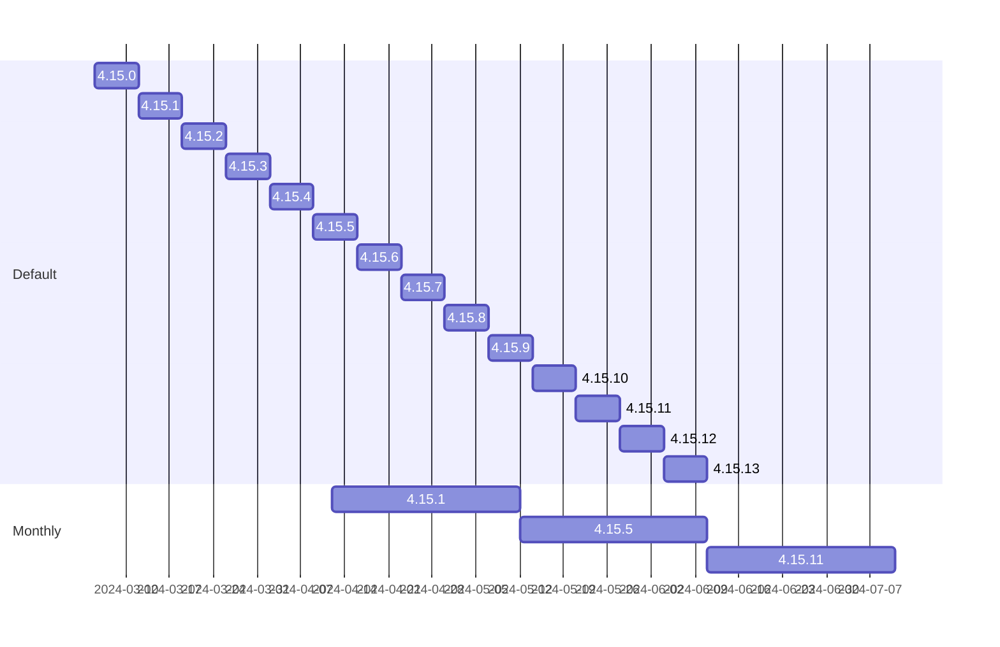

# Hypothetical 4.15 rollout with Policies
Monthly policy ships each second tuesday and picks a version shipped previously up to 60d old based on non public method used to determine the best version. 
48hr delay between Candidate, Early Insights, and Default respectively

First, Candidate, Early Insights, and Default channels only

Best case, we select relatively current monthly versions which are approximately 14 days old at time of delivery
Candidate and Early Insights removed for brevity

Now, worst case, 4.15.6 is the third monthly release and it's as old as possible given 60d lookback
Candidate and Early Insights removed for brevity

